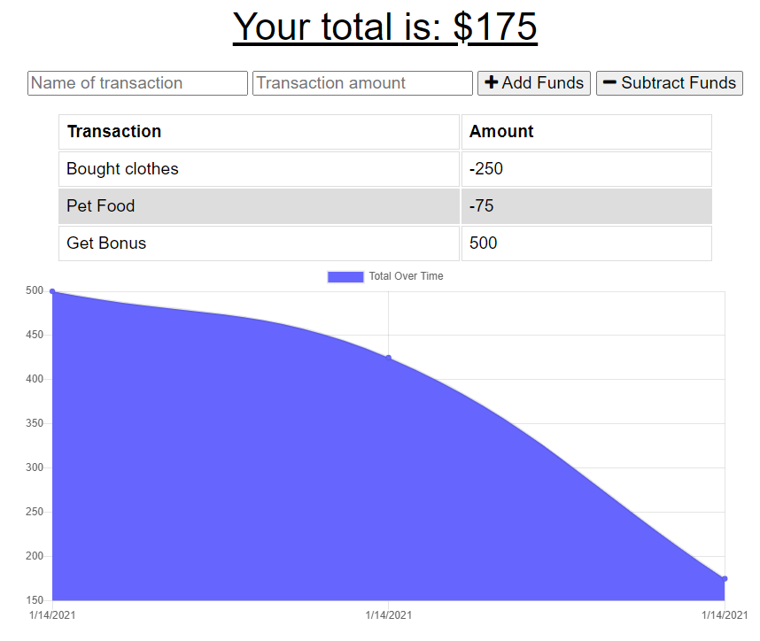

# 18-Budget-Tracker

Budget-Tracker

Here is a link to the Heroku deployed webpage: [https://trackerbudget.herokuapp.com/[]

## Project Description:
The user will be able to add expenses and deposits to their budget with or without a connection. When entering transactions offline, they should populate the total when brought back online.

Offline Functionality:

  * Enter deposits offline

  * Enter expenses offline

When brought back online:

  * Offline entries should be added to tracker.

## User Story
AS AN avid traveller
I WANT to be able to track my withdrawals and deposits with or without a data/internet connection
SO THAT my account balance is accurate when I am traveling

 ## Programs
 * HTML, CSS, Javascript, 
 * Node.js, Express.js, 
 * MongoDB, MongoAtlas,Bootstrap, JSON

## License 

## Author/s
Beshayr 

 